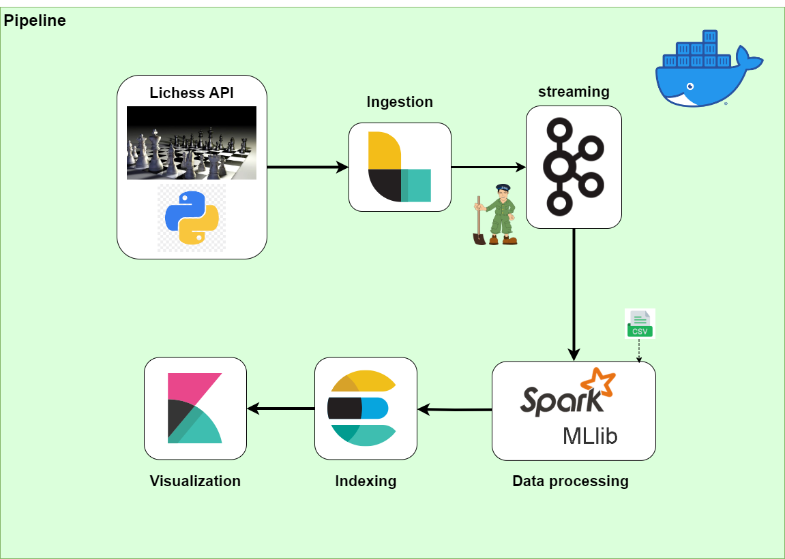
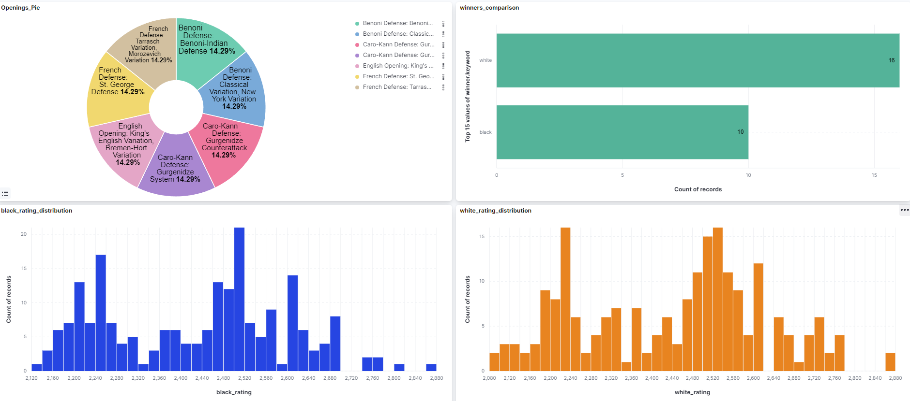

# ChessTV_Analytics

ChessTV_Analytics is a project designed and implemented for the TAP (Technology for advanced programming) course in Catania university.

## Technologies Used
* [Docker](https://www.docker.com/)
* [Logstash](https://www.elastic.co/logstash)
* [Apache Kafka](https://kafka.apache.org/)
* [Apache Spark](https://spark.apache.org/)
* [Elasticsearch](https://www.elastic.co/)
* [Kibana](https://www.elastic.co/kibana)

## Project pipeline

## How to start the project
* to use my python script you must have and API access token provided by the lichess site to access the api; more information [here](https://lichess.org/account/oauth/token)

* make sure you have the following files:
    * [this](https://archive.apache.org/dist/kafka/3.5.0/kafka_2.13-3.5.0.tgz) file in the kafka/setup directory
    * [this](https://dlcdn.apache.org/spark/spark-3.4.1/spark-3.4.1-bin-hadoop3.tgz) file in the spark/setup directory

* now you can run the file `start.py` of the project to buid the docker images for the project

* now the project can be run by using `docker compose up`
* after starting logstash you can run the `funny4.py` script
### ports of interest

* Kafka UI: http://localhost:8080
* Elasticsearch: http://localhost:9200
* Kibana: http://localhost:5601

## Final Dashboard

